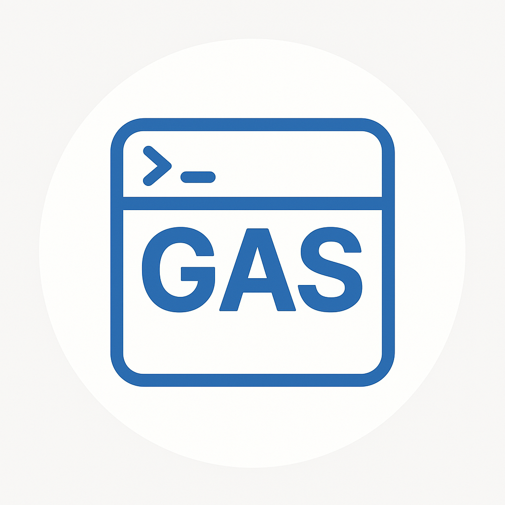

<div align="center">



# GAS Clasp MCP

Model Context Protocol (MCP) server for Google Clasp integration.

</div>

## Configuration

1. Install deno https://docs.deno.com/runtime/getting_started/installation/

2. Add to your MCP settings:

```json
{
  "mcpServers": {
    "gas-clasp": {
      "command": "deno",
      "args": [
        "run",
        "--allow-read=.",
        "--allow-run",
        "--allow-env",
        "--allow-net",
        "jsr:@hikae/gas-clasp-mcp/mcp.ts",
        "--rootdir",
        "/Users/xxx/workspace"
      ],
      "env": {},
      "disabled": false,
      "alwaysAllow": [],
      "autoApprove": []
    }
  }
}
```

## Tools

This MCP server provides tools to interact with the Google Apps Script
command-line tool [clasp](https://github.com/google/clasp).

### Environment Configuration (env)

Deployments can target specific environments:

- `development`: Development environment
- `production`: Production environment
  - **Important**: Production deployments require being on the `main` git branch
    with no uncommitted changes.

### Available Tools

1. **clasp_setup**: Sets up the clasp environment (checks/installs clasp,
   optional login).
2. **clasp_logout**: Logs out from the current Google account via clasp.
3. **clasp_create**: Creates a new Google Apps Script project.
4. **clasp_clone**: Clones an existing Google Apps Script project.
5. **clasp_pull**: Pulls remote changes to the local project. Automatically
   switches `.clasp.json` based on the specified environment.
6. **clasp_push_and_deploy**: Pushes local changes and optionally deploys.
   Automatically switches `.clasp.json` based on the specified environment.
7. **clasp_list**: Lists Google Apps Script projects associated with the
   account.

## Setup Development Environment

1. **Install Deno**: Follow the instructions at
   [https://deno.land/](https://deno.land/)
2. **Cache Dependencies**:
   ```bash
   deno cache mcp.ts
   ```
3. **Run Directly**:
   ```bash
   deno run --allow-read --allow-run --allow-env --allow-net mcp.ts --rootdir /path/to/project
   ```

## Build with Docker

```bash
docker login ghcr.io

docker buildx build --load -t gas-clasp-mcp .
docker tag gas-clasp-mcp ghcr.io/hikaruegashira/gas-clasp-mcp:latest
IMAGE_ID=$(docker inspect --format='{{.Id}}' gas-clasp-mcp | cut -d':' -f2 | head -c 12)
docker tag gas-clasp-mcp ghcr.io/hikaruegashira/gas-clasp-mcp:sha-$IMAGE_ID

docker push ghcr.io/hikaruegashira/gas-clasp-mcp:latest
docker push ghcr.io/hikaruegashira/gas-clasp-mcp:sha-$IMAGE_ID
```
